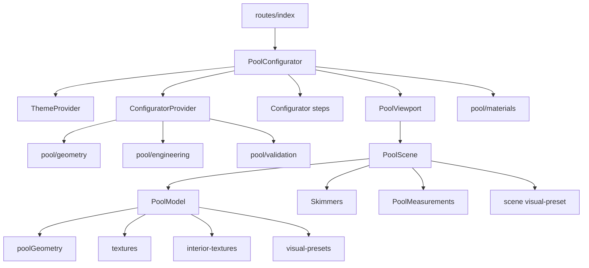

# Dependency graph

## Runtime graph



## Layer direction

```text
routes
  ↓
feature orchestration + steps
  ↓                    ↓
domain Context/store   viewport adapter
  ↓                    ↓
pure domain math       R3F scene
                       ↓
                  Three geometries/materials
```

Pure `types/config/geometry/engineering/format/validation` have no dependency on React or Three. `store.tsx` is the only React-aware domain state module. Three modules consume domain output but domain modules never import scene code.

## UI primitive inventory

`components/ui` contains standard shadcn wrappers: accordion, alert-dialog, alert, aspect-ratio, avatar, badge, breadcrumb, button, calendar, card, carousel, chart, checkbox, collapsible, command, context-menu, dialog, drawer, dropdown-menu, form, hover-card, input-otp, input, label, menubar, navigation-menu, pagination, popover, progress, radio-group, resizable, scroll-area, select, separator, sheet, sidebar, skeleton, slider, sonner, switch, table, tabs, textarea, toggle-group, toggle and tooltip. They depend on React plus their named Radix/third-party primitive and `cn`; only button/input/slider are central to the current configurator.

## External dependency roles

- TanStack Start/Router/Query: SSR shell, routing, provider context.
- React/RDOM: component/state runtime.
- Three/R3F/Drei/three-stdlib: WebGL and helpers.
- Tailwind/tw-animate/clsx/tailwind-merge/CVA: styling.
- Radix packages: accessible primitives.
- Lucide: icons.
- React Hook Form/Zod/resolvers: installed, but current pool forms are controlled Context fields.
- jsPDF, recharts, date-fns and several UI libraries: installed/template availability, not active in the core route.
